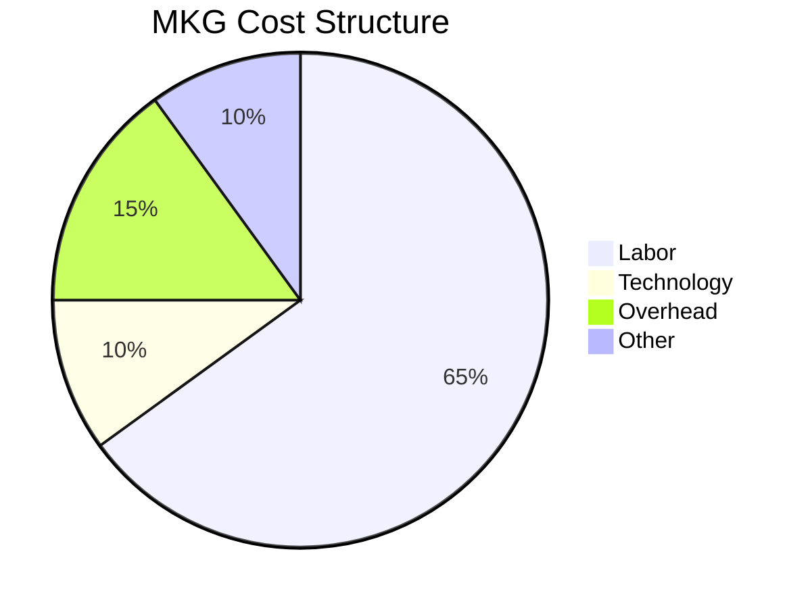
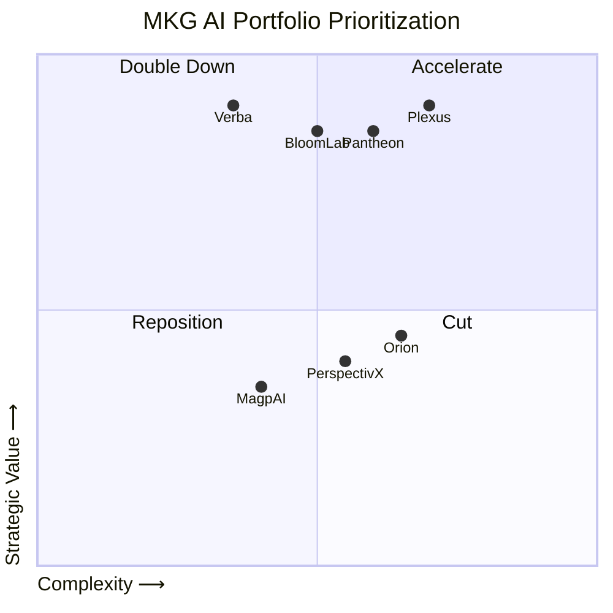
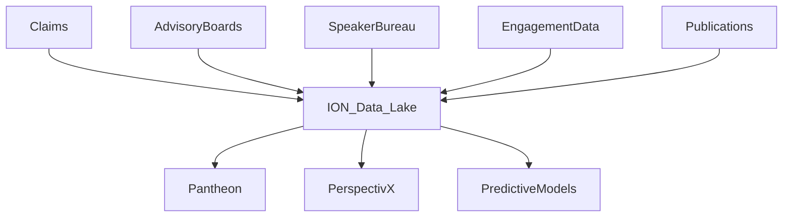

# MKG AI Opportunity & Roadmap Assessment  
## Fully Fleshed Strategic Evaluation Document  
*(Tweed Collective Outside-In Framework | March 2026)*

---

# 1️⃣ Executive Summary

## Current AI Posture

MKG has built a structured AI ecosystem under the **ION platform**, organized into:

- **KINETICS** (internal efficiency tools)
- **DIFFUSION** (client-facing AI products)
- **ION Data Lake** (proprietary data backbone)

AI maturity level: **Upper-Mid / Structured & Scaling**  
Strong governance and meaningful tooling, but a fragmented portfolio and limited closed-loop measurement.

---

## AI Maturity Radar

```mermaid
radar
    title MKG AI Maturity Assessment
    axes Strategy, Data Assets, Workflow Integration, External Differentiation, Governance, Measurement
    Strategy: 6
    Data Assets: 8
    Workflow Integration: 6
    External Differentiation: 6
    Governance: 8
    Measurement: 4
```

---

## Top Strengths

1. Proprietary ION Data Lake (claims, engagement, advisory, publication data)
2. Deep medical & compliance expertise embedded across teams

## Top Risks

1. Portfolio sprawl across 20+ branded AI tools
2. Limited closed-loop ROI measurement (especially 81qd)
3. Risk of commoditization in client-facing tools (LLM wrapper displacement)

## Immediate Focus Recommendation

1. Rationalize AI products and combine adjacent offerings
2. Focus data assets to create true differentiation

---

# 2️⃣ Business Drivers & Strategic Context

## Revenue Mix (Approximate)

```
Medical Communications      ██████████████ 35%
HCP Promotion               ████████       20%
Analytics (81qd)            ██████         15%
Market Research             ██████         15%
Market Access               ████           10%
Other                       ██             5%
```

## Cost Structure



## Economic Sensitivities

| Area | AI Impact Potential | EBITDA Sensitivity |
|------|--------------------|-------------------|
| Editorial Workflow | Moderate | High |
| Predictive Analytics | High | High |
| Market Research | High | Moderate |
| Creative Automation | Moderate | Low |

---

# 3️⃣ AI Initiative Inventory (MKG Specific)

## Internal – KINETICS (Enterprise + productivity tooling)

## Note for Slide Layout
**Place a box around the following pipeline tools and add a callout:**
*”Together these form an AI-driven content production pipeline that can reduce revision cycles, accelerate MLR readiness, and increase revenue-per-employee.”*

### Future-State AI Editorial Pipeline (Core Value Drivers)

| Initiative | Description | Value Source | Value Potential |
|---|---|---|---|
| **DynAImic Content** | Generates draft marketing content across channels. | Speed + Productivity | High |
| **Annotation Activation** | Auto-links claims to supporting literature. | Productivity + Speed | High |
| **Compliance Core** | Flags regulatory and FDA compliance risks. | Cost + Risk Reduction | High |
| **Route Reagent** | Validates content vs style and brand rules. | Cost + Speed | High |

---

### Supporting Insight and Knowledge Tools

| Initiative | Description | Value Source | Value Potential |
|---|---|---|---|
| **Practice Master** | Maps HCP affiliations and networks. | Speed + Productivity | Moderate |
| **Sentiment Tracker** | Tracks shifts in HCP sentiment signals. | Strategic Insight | Moderate |
| **Undermind** | Performs deep scientific literature searches. | Speed + Productivity | Moderate |
| **Brand Bonds** | Brand-trained AI assistant for team knowledge. | Productivity | Moderate |
| **Conversation Centrifuge** | Summarizes expert interviews into insights. | Speed + Productivity | Moderate |

---

### General Productivity and Workflow Tools

| Initiative | Description | Value Source | Value Potential |
|---|---|---|---|
| **ION (Internal AI Portal)** | Central hub for MKG AI tools and data. | Productivity | Moderate |
| **ChatMKG / Secure LLM Access** | Secure internal LLM workspace. | Productivity | Moderate |
| **Case Catalyst** | Retrieves and repurposes past case studies. | Productivity | Low–Moderate |
| **Meeting Nucleus** | Transcribes meetings and creates summaries. | Productivity | Low |
| **Strategic Brief** | Guides teams in building project briefs. | Productivity | Low |
| **Strategic Synthesis** | Converts ideas into structured project plans. | Productivity | Low |

---

## External – DIFFUSION (Client-facing products)

| Initiative | Positioning | Revenue Model | Displacement Risk |
|------------|------------|--------------|-------------------|
| MagpAI | Research augmentation / simulation | Add-on | Moderate |
| BloomLab | Real-time qual/quant hybrid | Project-based | Lower |
| PerspectivX | Concept scoring | Add-on | Moderate |
| Verba | Ad board synthesis | Embedded | Higher |
| Pantheon | HCP search / profiling | Project-based / subscription | Lower |
| Plexus | Influence mapping | Core analytics | Lower |
| Orion | Patient identification | Analytics | Moderate |

---

## Portfolio Heatmap (Strategic Value vs Complexity)



---

# 4️⃣ Differentiating Assets

## Moat Strength Assessment

```
ION Data Lake              ██████████ 9/10
Medical Expertise          █████████  8/10
Workflow Control           █████      5/10
Model Sophistication       ██         2/10
```

## Data Flow Diagram



---

# 5️⃣ Team & Governance

## Governance Structure

- Weekly AI Committee
- Biweekly AI Advocates
- Monthly Senior Leadership Review
- CFO cost-to-build ROI gating

## Observed Gaps

- No enterprise AI KPI dashboard
- No clear AI product strategy owner
- Limited attribution analytics FTE
- AI activation appears organically grown vs. prioritized top-down
- Multiple build teams distributed across the business, suggesting a decentralized investment model vs. a centrally allocated roadmap

---

# 6️⃣ Internal Value Story – Route Reagent

| Metric | Before | Target | Impact |
|--------|--------|--------|--------|
| Avg Routing Rounds | 6 | 4.5 | -25% |
| Editorial Hours/Job | 12 | 9 | -25% |
| Turnaround Days | 14 | 10 | -29% |

```
Jobs/year: 3,000
Savings per job: $250
Total Annual Savings: ~$750,000
Build Cost: ~$50,000
ROI Year 1: ~15x
```

### Sources / citations
- **CITATION NEEDED:** Confirm *jobs/year*, *savings per job*, and whether these are observed vs modeled.
- **Suggested source candidates:** Feb 2026 MKG board AI slides (internal efficiency section), ops reporting exports, or time-and-motion study notes.

---

# 7️⃣ Customer-Facing Value – Predictive Pantheon Scenario

> **Note:** The table below reflects *directional assumptions*. We should explicitly tie each assumption to a source (e.g., prior pricing proposals, win/loss notes, client interviews) or mark it as a hypothesis to validate.

| Metric | Current | Predictive Layer |
|--------|--------|-----------------|
| Project Revenue | $500K | $500K |
| Subscription Add-on | $0 | $150K |
| Retention | 75% | 85% |
| Upsell Rate | 20% | 35% |

## What you have to believe (assumption checklist)
- Predictive layer is priced at **$150K/customer/year** (or equivalent per project) and is accepted by customers.
- Retention improves from **75% → 85%** due to measurable performance lift / workflow embed.
- Upsell rate improves from **20% → 35%** because Predictive + Mapping increases cross-sell pull-through.

## Scale math (to translate assumptions into enterprise value)

Let:

- **N** = number of active customers eligible for Pantheon Predictive  
- **ARPA** = avg annual revenue per customer (baseline)  
- **AddOn** = annual subscription add-on price per customer (e.g., **$150K**)  
- **Attach** = add-on attach rate (0–1)  
- **ΔRet** = retention lift (e.g., **0.10** for 75%→85%)  
- **GM** = gross margin on incremental revenue (0–1)

Then:

**Incremental annual revenue (external / client-facing)**  
1) **Add-on revenue** = `N × Attach × AddOn`  
2) **Retention-driven revenue protection / lift** (simple approximation) = `N × ARPA × ΔRet`  
3) **Total incremental revenue** = (1) + (2)  
4) **Incremental gross profit** = `Total incremental revenue × GM`

> **TODO (Nate):** Provide **N**, **ARPA**, **Attach**, and **GM** (or we’ll pull from the Feb 2026 board materials). If you share even rough ranges, we can compute a low/base/high case.

### Placeholder example (replace with real N/ARPA/Attach/GM)
If `N=40`, `Attach=50%`, `AddOn=$150K`, `ARPA=$500K`, `ΔRet=10%`, `GM=60%`:

- Add-on revenue = `40 × 0.5 × 150K = $3.0M`
- Retention lift = `40 × 500K × 0.10 = $2.0M`
- Total incremental revenue = `$5.0M`
- Incremental gross profit = `$5.0M × 0.60 = $3.0M`

---

# 8️⃣ Roadmap Prioritization
 Roadmap Prioritization

## Double Down
- **Rationalize the AI product portfolio** and **combine adjacent products** (e.g., *Route Reagent + Annotation Activation* into a single workflow offering)
- **Focus data assets** to create true differentiation (tighten around the Data Lake + medical expertise + ION platform)

---

# 9️⃣ Change Management

| Dimension | Score |
|-----------|------|
| Leadership Alignment | 8/10 |
| AI Fluency | 5/10 |
| KPI Discipline | 2/10 |
| Product Focus | 4/10 |

Required:
- **Senior Product Manager (AI Product Leader)** to run point on requirements, prioritization, and portfolio consolidation
- Closed-loop analytics FTE
- Enterprise AI KPI dashboard

---

# 🔟 Quantifying “Getting It Right”

> **Important:** The prior EBITDA model was too arbitrary. Recast this into **Internal (cost/productivity)** vs **External (revenue uplift)** first, then roll up to EBITDA.

## Internal value (cost / productivity uplift)
Primary driver: editorial and workflow efficiency improvements from existing internal initiatives (e.g., routing/annotation improvements).

| Internal Category | Year 1 (placeholder) | Year 3 (placeholder) | Notes / Source |
|---|---:|---:|---|
| Editorial efficiency / cycle time | $1.0M | $2.5M | **CITATION NEEDED** (where did jobs/year and savings/job come from?) |
| QA / compliance automation | $0.3M | $0.8M | **CITATION NEEDED** |
| Other internal productivity | $0.2M | $0.7M | **CITATION NEEDED** |
| **Total internal impact** | **$1.5M** | **$4.0M** | |

## External value (revenue uplift)
Primary driver: client-facing upsell + retention lift from **Predictive Pantheon** (and any adjacent differentiated products).

| External Category | Year 1 (placeholder) | Year 3 (placeholder) | Notes / Source |
|---|---:|---:|---|
| Predictive Pantheon add-on revenue | $0.5M | $3.0M | Tie directly to **Section 7 scale math** |
| Retention / expansion lift | $0.3M | $2.0M | Tie directly to **Section 7 scale math** |
| Other differentiated products | $0.2M | $0.5M | **CITATION NEEDED / TBD** |
| **Total external impact** | **$1.0M** | **$5.5M** | |

## Roll-up to EBITDA (simple bridge)
Use:

`EBITDA uplift = (External incremental revenue × GM) + Internal savings − Incremental opex`

> **TODO (Nate):** Confirm **GM** assumptions and incremental opex (new hires + tooling). Once Section 7 inputs are real, this section becomes a straightforward bridge.

---

# 11️⃣ Final Recommendation

## Four “cards” (the whole story)
1. **Rationalize the AI portfolio**: consolidate adjacent SKUs; stop building net-new products until overlap is addressed.
2. **Differentiate through data + expertise**: focus on the Data Lake and medical expertise as the defensible moat.
3. **Instrument ROI**: closed-loop measurement that connects product usage → outcomes → willingness to pay.
4. **Operationalize delivery**: product-led prioritization with clear ownership (Senior PM / AI Product Leader) and a single intake/prioritization process.

