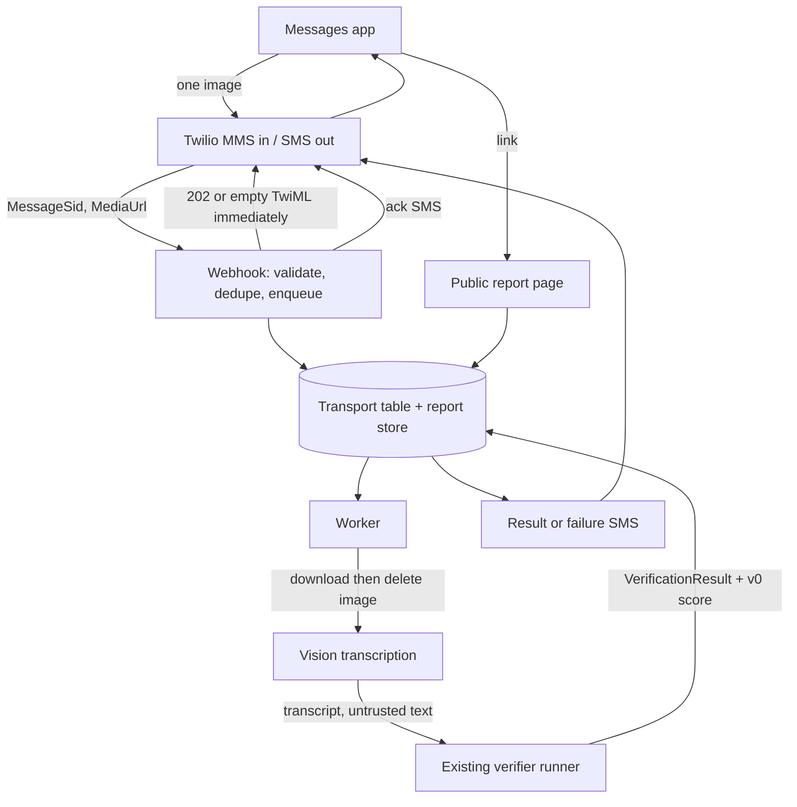

# GREX MMS — Product and architecture spec (v1)

**Product:** GREX by text — screenshot or photo in, evidence score by SMS, teardown on a link
**Status:** Spec only. Nothing in this document is implemented.
**Date:** 2026-09-23
**Audience:** Nate Beyor, then whoever builds the free demo
**Grounded in:** `docs/grex-prd.md` (scoring methodology v0.1) and the prototype in `lib/grex/`, `app/api/grex/verify/route.ts`, `app/clients/grex/report/[id]`

This is an analysis of the 2026-09-22 product vision, with defaults chosen where that vision left a fork. Section 5 is the reply that is owed. Everything after it is the spec that follows if those defaults stand.

---

## 1. Thesis

GREX by text is Surface B from the existing PRD, with the unbuilt iOS share extension replaced by a phone number.

The user already knows how to share a picture in Messages. GREX meets them there: one image in, one short SMS back, one mobile page that shows the same three-level explanation the prototype already renders (score, one-breath summary, per-claim evidence).

The score remains a measure of **public evidence strength** under methodology v0.1. It is not a validity percentage, a truth probability, or a scam verdict. The words *true, false, fake, real, lie,* and *misinformation* stay out of the SMS, the page, and the pipeline.

**Default name for the number in the SMS:** “evidence score,” with the existing band label beside it (`Strong evidence`, `Moderate evidence`, `Mixed evidence`, `Weak evidence`). “Confidence” stays in the methodology sense on the page, where the formula is visible. In a single SMS, “confidence 82/100” will be read as “82% true.”

### Non-goals

- Determining whether the world is as the image says.
- Detecting scams, fraud, or bad actors as a product promise. A contradicted FDA-approval claim can still surface, because that claim is verifiable. The product does not label the sender a scammer.
- A knowledge graph of the web. Section 5b defines what “claim collapse” can honestly mean on a basic web search.
- An account, a native app, or a score that changes because someone paid.
- Replacing the browser extension or the MCP surface. They keep the same scoring kernel.

---

## 2. What already exists, and what MMS has to add

The prototype is a real verifier with a simulated phone. MMS is the reverse shape: a real phone transport, and a report that still has to be built as a durable page.

| Concern | In the prototype today | What MMS requires |
|---|---|---|
| Claim pipeline | Extract → classify → search → evaluate → score. Prompt contract in `lib/grex/skills/shared.ts`. Caps: **8 claims**, **5 evidence items/claim**. | Same contract. New stage in front: image → text. New sentence after: result → SMS. |
| Scoring | `v0Score` in `lib/grex/types.ts`: supported = 1, insufficient = 0.5, contradicted = 0, average × 100. Bands at 80 / 60 / 40. `verifiable = 0` yields **no score** (`Nothing to check`). Server-side only. | Unchanged math. SMS prints `score.value` and `score.label`, or the no-score sentence. |
| Live verifier | `POST /api/grex/verify` streams SSE. One Claude conversation, Anthropic `web_search` (**6 searches per run**, not per claim), strict `submit_verification`, then `sanitizeVerification`. `maxDuration = 300`. Model `claude-opus-5`, effort default `medium`, **4 rounds**, **6,000 input chars**. | Call this runner from a worker. Do not invoke it inside the Twilio webhook. Do not loop back through the Clerk-gated HTTP route. |
| Screenshot behavior | `lib/grex/skills/screenshot.ts` assumes **text already extracted**. The phone UI (`ScreenshotSim`) plays a canned scenario. Milestone M4 (iOS share extension) is simulated. | OCR is new. The screenshot rubric is the right voice for the page. The SMS is a new, shorter artifact. |
| Explanation page | `ExplanationView`: score, summary, claim cards, methodology footer. Live ids resolve from **`sessionStorage`** (`grex:result:{id}`). A link opened later, or on another device, shows “This report has expired.” Canned ids resolve from `lib/grex/scenarios.ts`. | A public, unguessable URL that works from Messages days later. Same three levels. Session storage cannot do this. |
| Identity and retention | PRD: no user identity; raw inputs deleted; only normalized claims and short excerpts. The live API stores nothing. | The phone number is an identity whether we want it or not (Twilio has it; US carriers require STOP). Split transport identity from the public report. Delete the image. Keep the report for a fixed window. |
| Auth boundary | `middleware.ts` protects `/clients/grex` and `/api/grex/verify` with Clerk. The route also calls `clientAccessError('grex')`. | The webhook and the report URL are public. They do not belong behind the Tweed client wall. |
| Abstractions in the PRD | Model, search, extraction, and scoring are described as swappable. **In code, only scoring and the prompt skills are real modules.** Search is the Anthropic server tool, inlined in the route. | Reuse the route’s runner. Extract a function when the worker needs it. Do not invent a second search stack for the demo. |
| Knowledge graph | Absent. Evidence is a flat list of URLs with a stance. | V0 adds a per-report duplication count on those URLs. A graph picture and a citation trace are later, and the citation trace needs a decision to fetch pages. |

**Pipeline budget that shapes the product:** six web searches cover the whole image, then at most five snippets are kept per claim. A screenshot with eight factual claims gets a thin evidence set. “This claim appears 1,000 times and traces to one paper” is not observable under that budget. Raising the budget is a cost decision, not a visualization decision.

---

## 3. Happy path

1. The person already has the GREX number saved as a contact (how they got it: section 5g).
2. They take a screenshot, or a photo of something on a screen, and send that single image to the number in the system Messages app. iMessage falls back to MMS when the recipient is a carrier number. That fallback is the product.
3. GREX replies within a few seconds: `GREX got the image. Checking public evidence — usually under 2 minutes.`
4. A worker downloads the image from Twilio, transcribes it, deletes the image, and runs the existing verifier on the transcript.
5. GREX sends one result SMS. Two examples, using v0.1 so the arithmetic is checkable:

   Four verifiable claims, three supported, one insufficient:

   `GREX evidence 88/100 (Strong evidence). 3 of 4 claims have public support; 1 doesn't have enough to judge. https://<host>/r/<id>`

   No verifiable claims:

   `GREX found nothing factual to check in that image. Opinions and vague lines aren't scored. https://<host>/r/<id>`

6. The link opens a mobile page: band and number at the top, the one-breath summary, then one card per claim (verdict, rationale, sources). A line on each scored claim says how many retrieved pages collapse to how many publishers. The footer states methodology v0.1 in the same language as `ExplanationView`.

Failure SMS replaces the result SMS. It does not stack on top of it.

`GREX couldn't finish that check. Send the image again, or a tighter screenshot of the claim.`

---

## 4. User-visible rules (defaults)

These are product rules, not copy suggestions. The builder treats them as the contract.

| Situation | What the user gets |
|---|---|
| One image, transcription long enough, verifier finishes | Ack SMS, then result SMS with score or “nothing to check,” plus link |
| Image plus a typed caption | Caption is context for transcription. The image is the submission. |
| Text and no image | One SMS telling them to send a screenshot. The verifier does not run. |
| More than one attachment, or video / audio | One SMS: send a single screenshot. The verifier does not run. |
| Transcription under 40 characters, or the transcriber marks the image illegible | One SMS: a screenshot of the text works better than a photo of a page. No score. |
| Verifier exceeds 180 seconds, or returns no `submit_verification` | Failure SMS. No partial score. |
| `evidenceMode: degraded` (search failed) | Result SMS still sends if a result exists. The page shows the existing degraded notice. The SMS adds “Web search was limited.” |
| More than 8 claims | Page and SMS say the first 8 in reading order were checked. Requires a `truncated` flag on the tool result (section 6). |
| Second image while the first is in flight | `Still checking the last image.` The new image is dropped, not queued behind. |
| Fourth successful check in a rolling 24 hours for that phone | `GREX is paused until tomorrow on this number.` No model call. |
| STOP / HELP / START | Carrier-compliant opt-out. STOP is durable. No further messages until START. |

The result SMS stays inside two SMS segments when the link is short. The page carries the nuance. The SMS carries the number, the band, one clause, and the link.

---

## 5. Challenges — reply with yes, or an override

Each item has a default. A default stands unless you write a different decision. “Let’s see” is how the demo ships the wrong product.

### 5a. Latency

The live route is allowed to run for 300 seconds. Opus with adaptive thinking, up to four rounds, and six searches commonly lands in the tens of seconds and can run past a minute. Messages users read silence as failure at about fifteen seconds.

Twilio will retry the webhook if it does not get a response in roughly fifteen seconds. The verifier cannot run inside that request.

**Default:** two messages, and only two, on the success path — an immediate ack, then the result. No “still searching” drip. Each extra SMS costs money and trains people to ignore the thread.

**Time box:** ack as soon as the job is queued; result target under 90 seconds median; hard stop at 180 seconds, then the failure SMS. The 300-second route ceiling is a prototype allowance, not the SMS budget.

**Question:** Is an ack-plus-result pair acceptable, or do you want the user to wait in silence for a single message? Silence is the wrong default.

### 5b. Knowledge graph and “claim collapse”

The picture you described — a claim repeated a thousand times that traces to one paper — is a real explanation of why evidence *feels* abundant. It is also a different system from v0.1.

What we can actually see on one check:

- At most six searches, and at most five URLs retained per claim.
- Those URLs are whatever the search tool chose to return. Search products already hide duplicates. A hit count of “1,000” is not a field we have, and it would be a bad census if we did.
- Snippets do not include the reference list of a paper. Tracing a claim to a DOI means fetching pages and reading citations. That is outside “basic web search only,” which you already set as the evidence constraint. Keep that constraint for the demo.

**What “collapse” means, in three grades:**

| Grade | Definition | Honest label | When |
|---|---|---|---|
| Source duplication | Among the URLs already on the claim: group by registrable domain, and group titles that are the same story with a site-name suffix stripped. | “4 pages, 2 publishers, from the sources we retrieved.” | **V0, the free demo** |
| Source map | The same groups, drawn as claim → publisher, edges labeled “retrieved.” Per report only. | “Source map.” | **V1** |
| Provenance trace | Fetch the retrieved pages, pull citations and DOIs, and try to walk repeats back to a primary source. Optionally remember claims across reports. | “Provenance.” A cross-report index is a corpus of other people’s claims, which the PRD does not have. | **V2, and only after you explicitly lift the search-snippet limit** |

A force-directed graph of five links in the demo would look like a knowledge graph and would not be one. **Default: V0 ships the sentence, not the picture.** The sentence is the visualization. V1 may draw it once the sentence has been useful on real screenshots. V2 is the paper-trace, and it is a research project with a crawler, a parser, and a retention policy for a claim corpus.

**Question:** Do you accept a demo that explains repetition in one sentence per claim, with the graph deferred to V1 and the paper-trace deferred until we are willing to fetch pages?

### 5c. Score semantics

v0.1 already answers this. An 88 means: of the verifiable claims, the mix of supported / insufficient / contradicted averaged to 0.88 under equal weights. Insufficient evidence is half, because absence of evidence is not a refutation. Opinions, predictions, personal experiences, and vague lines are listed and **not scored**.

“How valid each claim was” slides the product into a verdict. The claim card already has the right words: `SUPPORTED`, `CONTRADICTED`, `INSUFFICIENT_EVIDENCE`, rendered in the prototype as support / contradicted / couldn’t verify. The page keeps those. The SMS never says valid, invalid, true, or false.

Model-internal `confidence` (0–1 on each evaluation) stays in the stored evaluation for methodology work and stays off the page and off the SMS, matching the PRD.

**Default SMS shape:** `GREX evidence <n>/100 (<band label>). <one clause>. <url>`

**Question:** Will you give up the phrase “confidence score 82/100” in the text message? The page can still say evidentiary confidence in the methodology footer, next to the formula.

### 5d. Cost, abuse, and how a subscription would map

Illustrative planning bands, to be replaced by a measurement on the first twenty real screenshots. They are not a quote.

| Piece | Order of magnitude | Note |
|---|---|---|
| Inbound MMS + two outbound SMS | Cents | Twilio list prices; confirm at implementation. Noise next to the model. |
| Vision transcription of one image | Cents to low tens of cents | Use a short vision call. Do not send the image into the long verifier. |
| Verification conversation | Likely the majority of the bill, easily several dimes and possibly more | Current settings: Opus, medium effort, up to 4 rounds, 6 searches, 16k output tokens. Thinking tokens dominate. |
| Report storage | Negligible | Text only. |

A public phone number is an unauthenticated spend API. The day the number is on a webpage, someone will script MMS at it.

**Defaults for the free demo:**

- 3 successful checks per phone-hash per rolling 24 hours.
- 1 check in flight per phone-hash. A second image during the first check is refused, not queued.
- A global daily dollar ceiling. Placeholder **$25/day**, which you should replace before the number is shared. When the ceiling hits, the webhook still acks Twilio and the user gets “GREX is paused for today.”
- The number is shared by you, personally, during the demo. It is not printed on the Tweed marketing site until the ceiling has tripped once on purpose in a test.
- Video, extra attachments, and illegible images never call the verifier.

**Subscription, later:** the buddy plan buys a higher quota and a saved contact. It does not buy a different score, a higher search budget, or a friendlier band. That is how principle 6 (“scores are never purchasable”) survives monetization. Price the plan from measured cost × included checks, with a hard monthly cap. Silent overage is forbidden; when they hit the cap, the reply says so and offers nothing automatic.

If included checks × measured cost exceed the subscription price, the plan is a subsidy. Say that in the pricing doc when the time comes. Do not discover it from the Twilio invoice.

**Question:** Is 3/day and a $25 global ceiling the right demo fence, and do you accept quota-only monetization later?

### 5e. Privacy

Two principles in the PRD collide with this product, and both collisions are manageable if we stop pretending they are not there.

**No identity.** Twilio receives the phone number. US A2P and toll-free rules require honoring STOP. A rate limit also needs a stable key. **Default:** store `HMAC-SHA256(phone)` with a server-side secret, in a transport table used for opt-out and rate limits. The public report has no phone hash, no raw number, and no join key a reader of the database dump can casually line up. Twilio remains the system that holds the raw number.

**Ephemeral inputs.** The PRD deletes screenshots and does not keep live reports. An SMS link that dies when the server forgets the session is a broken product — the prototype already behaves that way, on purpose, via `sessionStorage`. **Default:**

| Artifact | Retention |
|---|---|
| Image bytes | Deleted when the job finishes. A sweeper deletes any leftover at 15 minutes. Never written to the report. |
| Raw transcription | Private job log, 24 hours, for debugging bad OCR. Never rendered. |
| Public report | Normalized claims, verdicts, rationales, evidence excerpts and URLs, score, methodology version, duplication groups. **30 days**, then hard delete. |
| Opt-out hash | Until START, because the carrier rule outlives the report. |

The link is a capability URL: 128 bits of randomness. Anyone who has the SMS can open it, including someone the user forwarded it to. The page says that, in one line. `noindex`. No account recovery for a lost link; the check is gone with the phone thread.

The public page does **not** include `submittedText`. The prototype stores a 280-character clip on `VerificationResult` for the session-local page. On a URL that can be forwarded, that clip is how a screenshot of a medical message or a bank text gets republished. Claims are already normalized sentences; that is the text we show.

Residual risk, accepted for a private demo: a person can still get arbitrary sentences onto our domain by screenshotting their own text, because the claims *are* the content. Before the number is public, add a delete control on the page (possession of the URL is the auth) and a human takedown address in the footer.

**Question:** Is 30 days the retention you want for a page that may contain someone else’s claims, quoted from a photo the sender did not take?

### 5f. Photo versus screenshot, and the 8-claim cap

The screenshot skill already says OCR text can be fragmentary and that claims should be reconstructed charitably. That is right for a screenshot of Messages, a tweet, or a headline. It is optimistic for a photo of a printed article, a whiteboard, or a screen taken at an angle in a dark room.

**Default:** V0 accepts one image either way, and the quality gate is the transcription, not the MIME type. Under 40 characters, or an explicit illegible flag from the transcriber, and we refuse with the “send a screenshot of the text” reply. We do not score garbage. Handwriting is not a supported input; it fails the same gate.

**Eight claims.** `MAX_CLAIMS = 8`, first in document order, equal weights. A photo of a full article will be silently truncated by the current prompt, and the score will describe only the top of the page. That is acceptable for v0.1. It is not acceptable to hide.

**Default:** add `truncated: boolean` to the `submit_verification` payload when this is built, set true when the model dropped claims past eight. The SMS and the page say “Checked the first 8 claims.” Do not raise the cap for the demo. Eight claims times a six-search budget is already thin; sixteen would be theater.

**Question:** Do you want the cap visible in the SMS whenever it binds, knowing some screenshots of articles will always bind?

### 5g. Getting the number, without an app

There is no share extension in this demo. The onboarding surface is a contact card.

**Default:** one unlisted web page, mobile-first, with the number in large type, a “add contact” action, and three lines: screenshot the claim, send the picture to this contact, wait for the score. A `sms:` link can open a thread; it cannot attach the image. Do not pretend a deep link files the photo.

Carrier constraints to design around, confirmed against Twilio’s current docs at build time:

- Twilio’s own MMS ceiling is 5 MB. Many handsets and carriers are less forgiving. The demo does not compress and retry; if the carrier drops the message, we never see it, and the help page says so (“if it doesn’t send, screenshot a smaller crop”).
- MMS to a US toll-free or 10DLC number is a carrier product with registration in front of it. Budget the demo on **verification finishing before any outsider has the number**, not on buying a SIM and texting tomorrow.
- **Default number type: one US toll-free** for the demo (one number, national, MMS in / SMS out). A local 10DLC number is the later “this looks like a friend’s cell” option, and it has its own campaign registration. A short code is the wrong instrument for a demo.
- International MMS is out of the demo. The help page promises US picture messages only. Canadian delivery to a US toll-free number is unverified until someone tests it; the page does not promise it.
- Group threads are ignored. V0 is one human, one number.

**Question:** Toll-free for the demo — yes? And will you keep the number off public pages until carrier verification and the spend ceiling are both real?

### 5h. This Next.js repo, or a new GREX repo

**Default: this repository, and a separate deployable.** Not a new product repo for the demo. Not a route on the Tweed Collective site.

Reasons:

- The scoring kernel that must not fork is `lib/grex/types.ts` (`v0Score`, bands, `VerificationResult`), `lib/grex/skills/*`, and `lib/grex/verifyTool.ts`. A second repo copies them on day one and the methodologies drift by the second change to the prompt.
- The Tweed site is the wrong host. Clerk protects non-public routes. `/api/grex/verify` is additionally client-gated. Live reports live in the browser tab. Putting a consumer phone product behind that wall, or punching public exceptions through `middleware.ts` for a marketing site, mixes client-workspace auth with strangers’ photos.
- A new repo becomes the right move when a second production consumer needs the kernel (the extension, or billing), or when the worker’s dependency on this app becomes the bottleneck. Until then, a package extraction is ceremony.

**Shape of the default:**

- `lib/grex` stays the kernel.
- MMS webhook, worker, and public report live in a bounded area of this repo and **deploy as their own Vercel project** (own domain, own env, no Clerk).
- The prototype at `/clients/grex` keeps working and stays gated. It is not the demo URL in the SMS.

**Question:** Separate deployable from this repo — yes? A new repo is available as an override; it is the worse default because of methodology drift.

---

## 6. Architecture

### Components



**Webhook.** Public, signature-checked (Twilio request signature). Idempotent on `MessageSid` — Twilio retries. Respond immediately after the row is queued. The response body does not wait on OCR. Opt-out keywords are handled on this request, before any model spend.

**Worker.** Pulls a queued intake, fetches media with Twilio credentials, runs transcription, deletes bytes, calls the verifier. One attempt plus one retry on provider errors. A second retry is a failure SMS, not a third model bill.

**Verifier.** The function inside `app/api/grex/verify/route.ts` (`runVerification` plus `sanitizeVerification`), lifted so the worker calls it in-process. Same system prompt composition, same `submit_verification` tool, same caps, same `v0Score`. Surface id for these runs: `mms`, added to `GrexSurface` when this is built, so methodology events are distinguishable from the simulated screenshot surface.

The MMS skill starts from the screenshot skill (charitable OCR, promotional superlatives as opinion, specific embedded facts as verifiable, protective plain voice). It adds two instructions the screenshot skill does not need: set `truncated` when claims were dropped past eight, and write the summary so a single SMS clause can be cut from it. Scoring weights do not change.

**Search.** The Anthropic web search tool already wired in the route, max six uses. Evidence URLs still have to pass `safeUrl` (http/https only). The model still does not answer from memory. Degraded mode still exists.

**Transcription.** A separate, short vision call whose only job is a plain transcript plus `legible: boolean`. The transcript is untrusted data, wrapped in the same begin/end markers the route already uses. URLs visible in the image are claims or context, not pages the worker fetches.

**Report page.** Server-rendered from the report store. Mobile first. Reuse the visual behavior of `ScoreBadge`, `ClaimCard`, and the methodology footer. Omit the prototype chrome (hub link, “demo scenario” chip, client layout). Unknown or expired ids get the same calm empty state the prototype uses for a dead deep link, without offering a sign-in.

**What we will not build in the demo:** a queue framework as a product, a `SearchProvider` interface, a crawler, an account system.

### Processing states

The prototype’s states stay internal to the worker. The user’s phone sees a coarser set:

| Internal | User-visible |
|---|---|
| Queued | Ack SMS already sent |
| Transcribing | Silence |
| EXTRACTING / SEARCHING / EVALUATING | Silence |
| COMPLETE | Result SMS |
| Failed / timed out | Failure SMS |
| Refused (limits, illegible, opt-out) | The refusal SMS, and no result |

---

## 7. Data model

Two stores, logically separate. The public page can be served from the report store alone.

### Transport (private)

| Field | Purpose |
|---|---|
| `message_sid` | Unique. Idempotency key. |
| `phone_hash` | HMAC of E.164. Rate limit and STOP. |
| `status` | `queued \| transcribing \| verifying \| complete \| failed \| refused \| opted_out` |
| `received_at`, `completed_at` | Latency measurement. |
| `image_deleted_at` | Audit that bytes are gone. |
| `report_id` | Nullable. Set when a public report exists. |
| `error_code` | Internal. Never SMS’d verbatim from a provider. |

Raw media and raw transcript are not columns on this row. Transcript sits in a 24-hour log keyed by `message_sid` if we keep it at all.

### Report (public read, unlisted)

The report embeds a `VerificationResult`, with these MMS constraints on top:

| Field | Rule |
|---|---|
| `id` | Unguessable. The path is `/r/{id}`. |
| `surface` | `mms` |
| `mode` | `live` |
| `submittedText` | Empty on the public record. |
| `contentLabel`, `summary`, `claims`, `score`, `checkedAt`, `evidenceMode` | As `VerificationResult`. |
| `methodologyVersion` | `v0.1` copied onto the report so a later rubric change does not rewrite history. |
| `truncated` | True when the extractor hit `MAX_CLAIMS`. |
| `expiresAt` | `createdAt + 30 days`. |
| `provenance` | Optional. V0 shape below. Absent means “we did not compute duplication,” which should not happen if there is evidence. |

`Claim` and `Evidence` are unchanged: normalized sentence, verifiability, verdict, rationale, url, source name, title, snippet, stance. Model `confidence` may be stored and is not rendered.

### Provenance stub (V0)

Not a graph. Computed in the worker from evidence URLs already on the claim, after sanitizing.

```ts
interface ProvenanceStub {
  version: 'source-duplication-v0'
  claims: Array<{
    claimId: string
    pageCount: number
    publisherCount: number
    groups: Array<{
      publisher: string // registrable domain
      urls: string[]
      reason: 'same-domain' | 'similar-title'
    }>
  }>
}
```

Rendered as one line on the claim card: “4 pages, 2 publishers, among the sources retrieved for this check.” When `pageCount === publisherCount`, the line is omitted; there is nothing to collapse. The page caption, once per report, reads: “Repetition here only compares the pages retrieved for this check. It is not a map of the web and it does not trace a claim to an original paper.”

V1 may add coordinates for a drawing. V1 does not add node types the stub does not have.

---

## 8. Roadmap

### V0 — free demo

The loop in section 3. Screenshot-quality images, score SMS, durable teardown page, duplication sentence, rate limits, toll-free number, separate deployable. No graph picture, no accounts, no payment, no change to v0.1 weights.

Pipeline additions that are in V0 because the loop is false without them: image transcription, `truncated` on the tool result, `surface: 'mms'`, a public report row, deletion of the image.

### V1 — source map

Draw the V0 groups. Tune transcription on the images the demo actually received. Adjust the daily cap and the 180-second box using measured latency and cost. Delete-this-report control if it was not forced earlier by going public. Still basic web search. Still equal claim weights.

Only consider a higher search budget here, and only with the measured cost in hand. More searches improve evidence quality more than a diagram does.

### Monetization

After the demo criteria in section 10, not before. Buddy subscription as quota. Details in section 9.

### V2 — provenance

Page fetches, citation extraction, an explicit new decision on whether GREX keeps a cross-report claim index. That index is a different privacy product from “we forgot your screenshot.” It is out of every default in this spec.

---

## 9. Monetization

| | Per-check | Buddy subscription | Free demo |
|---|---|---|---|
| User action | Pay, then text, or text and get billed | Subscribe once, text like a contact | Text, inside a small cap |
| Fits the loop | Poorly. Payment sits in the middle of “I just saw a claim.” | Well. The number is the product relationship you described. | This is how we learn if they text again. |
| Unit economics | Easy to stay above cost. | Only if included checks × measured cost fit under the price, with a hard cap. | A subsidy, fenced by section 5d. |
| Principle 6 | Safe if the score is identical and the charge is for the check. Still easy to misread as paying for a verdict. | Safe if payment changes quota only. | Safe. |
| Abuse | Card fraud and receipt toil. | Account farming. Manageable. | The entire threat. Fences required. |

**Recommendation:** run the free demo with the fences in section 5d. If people send a second image within a week, sell a buddy subscription whose only upgrade is quota and a contact they were going to save anyway. Keep per-check as a later, user-initiated pack for heavy senders, never as silent overage, and not as the thing we launch.

Do not take payment in V0. A paywall on twenty friends teaches pricing theater, not willingness to pay.

---

## 10. Success criteria for the free demo

Measured on real images from people who are not the builder, over a bounded trial (enough volume to see a second-text rate; not an open internet launch).

| Criterion | Bar |
|---|---|
| Completion | A person who has only the help page can send an image and open the report without a walkthrough. |
| Latency | Median time from inbound MMS to result SMS under 90 seconds. At least 90% under 180 seconds, or a failure SMS. |
| Comprehension | In a short ask-back, people describe the number as evidence strength. If they say “it told me this was fake,” the SMS copy failed, regardless of the score. |
| Repeat | At least 30% of phone hashes with one successful result send another image within 7 days. That is the buddy signal. |
| Honesty of truncation | Every report that hit 8 claims says so on the page and in the SMS. |
| Cost | After a 20-check burn-in, write down the median cost per successful check. The ongoing ceiling uses that number. Planning placeholder before measurement: stay under **$1** per successful check at current model settings, or turn effort down until you do. |
| Retention audit | Zero image objects older than 15 minutes. No public report contains a phone number, a transcript dump, or `submittedText`. |
| Abuse fence | A single phone cannot receive a fourth successful check inside 24 hours. The global ceiling stops new model calls and still answers Twilio. |

A demo that hits latency and fails comprehension has the wrong product. Fix the words before adding a graph.

---

## 11. Out of scope for V0

- Twilio implementation, carrier registration, purchasing a number, and any secret. This document does not authorize that work by itself.
- Native apps, the iOS share extension, Chrome extension changes, WhatsApp, RCS features, email ingest.
- A knowledge-graph visualization, embeddings, citation crawling, DOI resolution, cross-report claim memory.
- Changing v0.1 weights, claim importance, or scam detection.
- Accounts, subscriptions, receipts, per-text billing.
- Multi-image MMS, video, voice notes, group chats, international numbers.
- Showing the photo, the raw OCR, or the sender’s phone number on the report.
- Putting the webhook or the report on `/clients/grex` or behind Clerk.
- Anonymous product telemetry beyond what is required to enforce the caps and to compute section 10. The PRD’s M6 telemetry milestone stays deferred.

---

## 12. Default ledger

Reply on the PR with overrides. Silence adopts the row.

| # | Default |
|---|---|
| 1 | This is Surface B via MMS, same kernel, new transport and durable report. |
| 2 | SMS says `GREX evidence N/100 (band)`. No “valid,” no “confidence score” in the text. |
| 3 | Ack SMS plus one result or failure SMS. No progress drip. 180s hard stop. |
| 4 | V0 provenance is a sentence: pages vs publishers among retrieved URLs. Graph picture is V1. Paper-trace is V2 and requires fetching pages. |
| 5 | v0.1 formula unchanged. No score when nothing is verifiable. |
| 6 | 3 successful checks per phone-hash per 24h, 1 in flight, $25/day global placeholder ceiling, number unlisted. |
| 7 | Image gone in minutes. Public report kept 30 days. Phone stored only as an HMAC for STOP and rate limits. Public page omits raw text. |
| 8 | Illegible photos refused. Cap stays 8 and is disclosed when it binds. |
| 9 | One US toll-free number. Help page explains screenshot → contact → wait. |
| 10 | Same repo, separate deployable, `lib/grex` shared. Prototype routes stay client-gated and out of the SMS link. |
| 11 | Monetize later with a quota subscription. Free demo takes no payment. |
