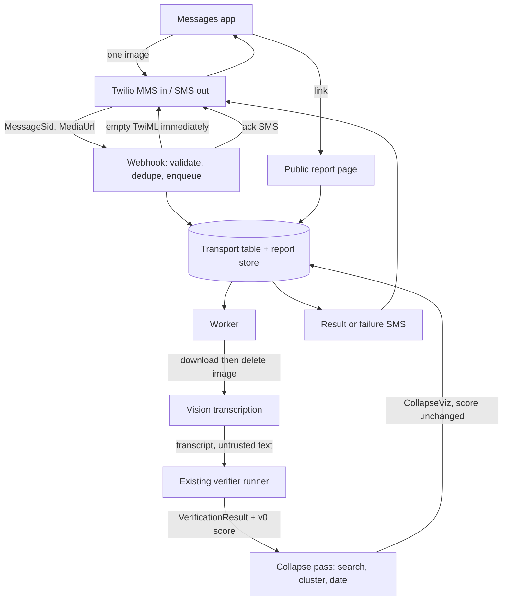

# GREX MMS — Product and architecture spec (v1)

**Product:** GREX by text — screenshot or photo in, evidence score by SMS, teardown on a link
**Status:** Spec only. Nothing in this document is implemented.
**Date:** 2026-09-23
**Audience:** Nate Beyor, then whoever builds the free demo
**Grounded in:** `docs/grex-prd.md` (scoring methodology v0.1) and the prototype in `lib/grex/`, `app/api/grex/verify/route.ts`, `app/clients/grex/report/[id]`

This is an analysis of the 2026-09-22 product vision. A 2026-09-23 follow-up locked three decisions, and this draft already applies them:

1. A visible claim-collapse diagram ships in the free demo (V0). It has to look like provenance on day one, and it has to stay honest about being a picture of search hits.
2. Latency is acceptable. GREX is trust, not speed. The phone gets an ack immediately and the score when the check is actually done.
3. The only user-facing frame is **evidence strength**. Supported, insufficient, contradicted, then the v0.1 aggregate.

Section 5 is what is still open. Everything after it follows the locks plus the defaults in that section.

---

## 1. Thesis

GREX by text is Surface B from the existing PRD, with the unbuilt iOS share extension replaced by a phone number.

The user already knows how to share a picture in Messages. GREX meets them there: one image in, an ack while the check runs, then one short SMS with the evidence score and a link. The link opens a mobile page in a fixed order: evidence score, per-claim teardown, then a collapse diagram of where the wording showed up.

The score is **public evidence strength** under methodology v0.1. Bands stay `Strong evidence`, `Moderate evidence`, `Mixed evidence`, `Weak evidence`. The SMS calls the number an evidence score. The words *true, false, fake, real, lie, misinformation,* and *valid* stay out of the SMS, the page, and the pipeline. Model-internal confidence (0–1 on an evaluation) stays stored for methodology work and stays off the screen, matching the PRD.

### Non-goals

- Determining whether the world is as the image says.
- Detecting scams, fraud, or bad actors as a product promise. A contradicted FDA-approval claim can still surface, because that claim is verifiable. The product does not label the sender a scammer.
- A citation knowledge graph, a web-wide volume count, or a declared original paper. V0 does ship a collapse diagram (sections 5b and 7). The diagram is built from public web search hits, clustered and dated with a deterministic heuristic.
- An account, a native app, or a score that changes because someone paid.
- Replacing the browser extension or the MCP surface. They keep the same scoring kernel.

---

## 2. What already exists, and what MMS has to add

The prototype is a real verifier with a simulated phone. MMS is the reverse shape: a real phone transport, and a report that still has to be built as a durable page.

| Concern | In the prototype today | What MMS requires |
|---|---|---|
| Claim pipeline | Extract → classify → search → evaluate → score. Prompt contract in `lib/grex/skills/shared.ts`. Caps: **8 claims**, **5 evidence items/claim**. | Same contract. New stage in front: image → text. New sentence after: result → SMS. |
| Scoring | `v0Score` in `lib/grex/types.ts`: supported = 1, insufficient = 0.5, contradicted = 0, average × 100. Bands at 80 / 60 / 40. `verifiable = 0` yields **no score** (`Nothing to check`). Server-side only. | Unchanged math. SMS prints `score.value` and `score.label`, or the no-score sentence. |
| Live verifier | `POST /api/grex/verify` streams SSE. One Claude conversation, Anthropic `web_search` (**6 searches per run**, not per claim), strict `submit_verification`, then `sanitizeVerification`. `maxDuration = 300`. Model `claude-opus-5`, effort default `medium`, **4 rounds**, **6,000 input chars**. | Call this runner from a worker. Do not invoke it inside the Twilio webhook. Do not loop back through the Clerk-gated HTTP route. |
| Screenshot behavior | `lib/grex/skills/screenshot.ts` assumes **text already extracted**. The phone UI (`ScreenshotSim`) plays a canned scenario. Milestone M4 (iOS share extension) is simulated. | OCR is new. The screenshot rubric is the right voice for the page. The SMS is a new, shorter artifact. |
| Explanation page | `ExplanationView`: score, summary, claim cards, methodology footer. Live ids resolve from **`sessionStorage`** (`grex:result:{id}`). A link opened later, or on another device, shows “This report has expired.” Canned ids resolve from `lib/grex/scenarios.ts`. | A public, unguessable URL that works from Messages days later. Score, teardown, then the collapse diagram. Session storage cannot do this. |
| Identity and retention | PRD: no user identity; raw inputs deleted; only normalized claims and short excerpts. The live API stores nothing. | The phone number is an identity whether we want it or not (Twilio has it; US carriers require STOP). Split transport identity from the public report. Delete the image. Keep the report for a fixed window. |
| Auth boundary | `middleware.ts` protects `/clients/grex` and `/api/grex/verify` with Clerk. The route also calls `clientAccessError('grex')`. | The webhook and the report URL are public. They do not belong behind the Tweed client wall. |
| Abstractions in the PRD | Model, search, extraction, and scoring are described as swappable. **In code, only scoring and the prompt skills are real modules.** Search is the Anthropic server tool, inlined in the route. | Reuse the route’s runner. Extract a function when the worker needs it. Do not invent a second search stack for the demo. |
| Collapse diagram | Absent. Evidence is a flat list of URLs with a stance. | **In V0.** A second, deterministic pass over web search hits builds `CollapseViz` (section 7). The model does not pick a root and does not draw the picture. |

**Two budgets, on purpose.** The score still comes from the existing verifier: six web searches for the whole image, at most five evidence items kept per claim. That set is too small to look like collapse, and it is the wrong place to widen the search, because widening it would silently change v0.1. The diagram gets its own retrieval pass (section 6): up to one quoted-phrase search per verifiable claim, at most eight searches, at most eight hits each. The page says the score and the diagram were gathered separately.

Neither budget can support the sentence “this claim appears 1,000 times online.” V0 never prints a web-wide count. The picture collapses the hits we actually retrieved.

---

## 3. Happy path

1. The person already has the GREX number saved as a contact (how they got it: section 5g).
2. They take a screenshot, or a photo of something on a screen, and send that single image to the number in the system Messages app. iMessage falls back to MMS when the recipient is a carrier number. That fallback is the product.
3. GREX replies within a few seconds, before any model work finishes: `Tough one — working on it. I'll text the evidence score when it's ready.`
4. A worker downloads the image from Twilio, transcribes it, deletes the image, runs the existing verifier on the transcript, then runs the collapse pass. A minute or more is a normal run. If the job is still open at 75 seconds, one mid-status SMS goes out: `Still working — reading where these claims show up publicly.` If the result is already on its way, the mid-status is skipped.
5. GREX sends one result SMS. Two examples, using v0.1 so the arithmetic is checkable:

   Four verifiable claims, three supported, one insufficient:

   `GREX evidence 88/100 (Strong evidence). 3 of 4 claims have public support; 1 doesn't have enough to judge. https://<host>/r/<id>`

   No verifiable claims:

   `GREX found nothing factual to check in that image. Opinions and vague lines aren't scored. https://<host>/r/<id>`

6. The link opens a mobile page in this order, and only this order:
   1. Evidence score (band and number).
   2. The one-breath summary and the claim teardown (one card per claim: supported, insufficient, or contradicted, with rationale and the evidence URLs that fed the score).
   3. The collapse diagram, below the teardown.
   4. The v0.1 methodology footer, same meaning as `ExplanationView`: each verifiable claim counts 1 if supported, 0.5 if evidence was insufficient, 0 if contradicted; the score is the average × 100; the number is evidence strength.

Failure SMS replaces the result SMS. It does not stack on top of it.

`GREX couldn't finish that check. Send the image again, or a tighter screenshot of the claim.`

---

## 4. User-visible rules (defaults)

These are product rules, not copy suggestions. The builder treats them as the contract.

| Situation | What the user gets |
|---|---|
| One image, transcription long enough, verifier finishes | Ack SMS immediately. Optional mid-status at 75 seconds if still running. Result SMS with the evidence score or “nothing to check,” plus link |
| Image plus a typed caption | Caption is context for transcription. The image is the submission. |
| Text and no image | One SMS telling them to send a screenshot. The verifier does not run. |
| More than one attachment, or video / audio | One SMS: send a single screenshot. The verifier does not run. |
| Transcription under 40 characters, or the transcriber marks the image illegible | One SMS: a screenshot of the text works better than a photo of a page. No score. |
| Job still open at 75 seconds | One mid-status SMS. Never a second one. |
| Job exceeds 5 minutes, or the verifier returns no `submit_verification` | Failure SMS. No partial score. Five minutes is a stuck-job guard, not a speed target. |
| `evidenceMode: degraded` (search failed) | Result SMS still sends if a result exists. The page shows the existing degraded notice. The SMS adds “Web search was limited.” |
| More than 8 claims | Page and SMS say the first 8 in reading order were checked. Requires a `truncated` flag on the tool result (section 6). |
| Second image while the first is in flight | `Still checking the last image.` The new image is dropped, not queued behind. |
| Fourth successful check in a rolling 24 hours for that phone | `GREX is paused until tomorrow on this number.` No model call. |
| STOP / HELP / START | Carrier-compliant opt-out. STOP is durable. No further messages until START. |

The result SMS stays inside two SMS segments when the link is short. The page carries the nuance. The SMS carries the number, the band, one clause, and the link.

---

## 5. Locks and the challenges that remain

5a, 5c, and the existence of the V0 diagram are locked. The questions under 5b, 5d, 5e, 5f, 5g, and 5h still need a yes or an override. A default stands unless you write a different decision.

### 5a. Latency — locked

Waiting is part of the product. A check that takes a minute, or two, is a finished check. The prototype route already allows 300 seconds; the SMS product should feel like that kind of care, not like a chat reply.

Twilio still needs a webhook response in about fifteen seconds, or it retries. That constraint is transport. It is not a product deadline. The webhook enqueues and returns. The worker takes the time it takes.

**Patience points (locked shape):**

| When | Message | Always? |
|---|---|---|
| Immediately after the image is queued | `Tough one — working on it. I'll text the evidence score when it's ready.` | Yes |
| 75 seconds, and the result is not already sent | `Still working — reading where these claims show up publicly.` | Only if still running |
| When the report is stored | Evidence-score SMS plus link | Yes, on success |
| 5 minutes with no report | Failure SMS. No partial score. | Guardrail |

No third status ping. No percentage. No “usually under two minutes.”

**Still open:** the 75-second mid-status is the proposed second patience point. Say if you want the ack and the final only.

### 5b. Claim collapse — in V0; the open question is honesty

Locked: the free demo’s report has a collapse diagram under the teardown. It is the visible differentiator. It should read, at a glance, as many mentions narrowing to a few roots, with a date on a root when we have one.

The risk is the glance. A funnel that looks like provenance will be remembered as “GREX found the original paper.” The build has to make that reading hard.

**What the diagram is.** For each verifiable claim, a deterministic pass:

1. Search the public web for a quoted distinctive fragment of the claim (section 6). Keep the evidence URLs from scoring as extra mentions. Cap the new hits.
2. Canonicalize URLs (scheme, host, tracking parameters, trailing slash, obvious AMP wrappers).
3. Cluster near-duplicates: same canonical URL, or titles that match after the site-name suffix is stripped (token Jaccard ≥ 0.75), or a shared six-word phrase in the snippets.
4. Label each domain with a static host list: `journal-or-preprint`, `government`, `wire`, `press-release`, `encyclopedia`, `social`, `other`. The list is data. The model does not assign the label.
5. Inside a cluster, the root is the mention with the earliest observed date. Tie-break by domain kind in the order above, then by the shorter canonical URL. If nobody in the cluster has a date, there is no root. The cluster still draws, labeled as repeats without an origin.

**What the diagram is not.**

- It is not a count of how often the claim exists on the internet. Search tools dedupe before we see results, and they do not hand us a reliable census. The chip says `8 pages → 2 clusters`, meaning eight retrieved pages, two clusters. It never says “appeared 1,000 times.”
- It is not a citation trail. We do not read bibliographies, resolve DOIs, or walk “according to.” That work needs page fetches aimed at references, and a decision to store a corpus across reports. It stays V2.
- The model does not choose the root, the clusters, or the caption. Code does. Otherwise the picture will upgrade itself into a story.

**Dates, and the one exception to “search results only.”** A date counts only if we can point at where we saw it:

| Source | When we use it |
|---|---|
| A date field on the search hit | First choice |
| A date written in the title or snippet | Second |
| `article:published_time` or JSON-LD `datePublished` from a single GET of that URL | Third, and only for a provisional root |

The third row is a public-page read for a date string. The HTML is discarded. Links inside the page are ignored. The body is not evidence and cannot move the score. **Default: this date read is on for V0**, capped at one GET per cluster, three-second timeout, failure leaves the cluster undated. It is not a specialty evidence API. It is also more than the search snippet. Turn it off and the diagram still ships; many roots will say “No date in what we retrieved,” which is the correct screen when we refuse to guess.

**Volume over time.** A Google Trends line is the picture you described, and Trends is a separate API (it is not the `web_search` tool, and it is not a page we can scrape reliably). **Trends stays out of V0.** The search-only stand-in is a monthly bar chart of dates already on the retrieved mentions, drawn only when at least three mentions have a date. The axis title is “Dates printed on these results.” Fewer than three dated mentions, and the chart is omitted with the line “Not enough dates in these results to show a timeline.” That omission is better than a two-point trend.

**Score and diagram stay uncoupled.** Collapse hits do not re-enter evaluation. Putting them into the score would be methodology v0.2. The section caption on every report is fixed:

> The score above uses the sources in the claim cards. This diagram uses a wider public-web search for where the wording showed up. “Earliest” means the earliest date we could see on those results. It is not a citation trail, and it is not proof of who published first.

**Question:** Date-meta GET on for V0 — yes? And do you accept that the diagram is forbidden from changing the evidence score?

### 5c. Evidence strength — locked

v0.1 is the whole meaning of the number. An 88 means the verifiable claims averaged to 0.88 with equal weights: supported = 1, insufficient = 0.5, contradicted = 0. Insufficient evidence is half because a missing source is not a refutation. Opinions, predictions, personal experiences, and vague lines are listed and carry no score. Zero verifiable claims produce no number (`Nothing to check`).

User-facing words, and only these:

| Layer | Copy |
|---|---|
| SMS | `GREX evidence <n>/100 (<band label>)` |
| Page hero | The same number and the same band label the prototype already uses |
| Claim card | Supported / couldn’t verify / contradicted, matching `SUPPORTED` / `INSUFFICIENT_EVIDENCE` / `CONTRADICTED` |
| Footer | The v0.1 formula, described as evidence strength |

“Confidence score,” “validity,” and “how valid the claim was” are out of the SMS and the page. The methodology footer keeps the PRD sentence that a score is the strength of publicly available evidence.

### 5d. Cost, abuse, and how a subscription would map

Illustrative planning bands, to be replaced by a measurement on the first twenty real screenshots. They are not a quote.

| Piece | Order of magnitude | Note |
|---|---|---|
| Inbound MMS + two or three outbound SMS | Cents | Ack, sometimes one mid-status, then the result. Twilio list prices; confirm at implementation. Noise next to the model. |
| Vision transcription of one image | Cents to low tens of cents | Use a short vision call. Do not send the image into the long verifier. |
| Verification conversation | Likely the majority of the bill, easily several dimes and possibly more | Current settings: Opus, medium effort, up to 4 rounds, 6 searches, 16k output tokens. Thinking tokens dominate. |
| Collapse pass | Another search bill, smaller than the verifier if it stays capped | Up to 8 extra web searches plus at most one date-meta GET per cluster. Still public web. Re-measure with the score cost; the $1 planning ceiling in section 10 includes this pass. |
| Report storage | Negligible | Text only. |

A public phone number is an unauthenticated spend API. The day the number is on a webpage, someone will script MMS at it.

**Defaults for the free demo:**

- 3 successful checks per phone-hash per rolling 24 hours.
- 1 check in flight per phone-hash. A second image during the first check is refused, not queued.
- A global daily dollar ceiling. Placeholder **$25/day**, which you should replace before the number is shared. When the ceiling hits, the webhook still acks Twilio and the user gets “GREX is paused for today.”
- The number is shared by you, personally, during the demo. It is not printed on the Tweed marketing site until the ceiling has tripped once on purpose in a test.
- Video, extra attachments, and illegible images never call the verifier.

**Subscription, later:** the buddy plan buys a higher quota and a saved contact. It does not buy a different score, a higher search budget, or a friendlier band. That is how principle 6 (“scores are never purchasable”) survives monetization. Price the plan from measured cost × included checks, with a hard monthly cap. Silent overage is forbidden; when they hit the cap, the reply says so and offers nothing automatic.

If included checks × measured cost exceed the subscription price, the plan is a subsidy. Say that in the pricing doc when the time comes. Do not discover it from the Twilio invoice.

**Question:** Is 3/day and a $25 global ceiling the right demo fence, and do you accept quota-only monetization later?

### 5e. Privacy

Two principles in the PRD collide with this product, and both collisions are manageable if we stop pretending they are not there.

**No identity.** Twilio receives the phone number. US A2P and toll-free rules require honoring STOP. A rate limit also needs a stable key. **Default:** store `HMAC-SHA256(phone)` with a server-side secret, in a transport table used for opt-out and rate limits. The public report has no phone hash, no raw number, and no join key a reader of the database dump can casually line up. Twilio remains the system that holds the raw number.

**Ephemeral inputs.** The PRD deletes screenshots and does not keep live reports. An SMS link that dies when the server forgets the session is a broken product — the prototype already behaves that way, on purpose, via `sessionStorage`. **Default:**

| Artifact | Retention |
|---|---|
| Image bytes | Deleted when the job finishes. A sweeper deletes any leftover at 15 minutes. Never written to the report. |
| Raw transcription | Private job log, 24 hours, for debugging bad OCR. Never rendered. |
| Public report | Normalized claims, verdicts, rationales, evidence excerpts and URLs, score, methodology version, and the collapse diagram (public URLs, titles, snippets, dates). **30 days**, then hard delete. |
| Opt-out hash | Until START, because the carrier rule outlives the report. |

The link is a capability URL: 128 bits of randomness. Anyone who has the SMS can open it, including someone the user forwarded it to. The page says that, in one line. `noindex`. No account recovery for a lost link; the check is gone with the phone thread.

The public page does **not** include `submittedText`. The prototype stores a 280-character clip on `VerificationResult` for the session-local page. On a URL that can be forwarded, that clip is how a screenshot of a medical message or a bank text gets republished. Claims are already normalized sentences; that is the text we show.

Residual risk, accepted for a private demo: a person can still get arbitrary sentences onto our domain by screenshotting their own text, because the claims *are* the content. Before the number is public, add a delete control on the page (possession of the URL is the auth) and a human takedown address in the footer.

**Question:** Is 30 days the retention you want for a page that may contain someone else’s claims, quoted from a photo the sender did not take?

### 5f. Photo versus screenshot, and the 8-claim cap

The screenshot skill already says OCR text can be fragmentary and that claims should be reconstructed charitably. That is right for a screenshot of Messages, a tweet, or a headline. It is optimistic for a photo of a printed article, a whiteboard, or a screen taken at an angle in a dark room.

**Default:** V0 accepts one image either way, and the quality gate is the transcription, not the MIME type. Under 40 characters, or an explicit illegible flag from the transcriber, and we refuse with the “send a screenshot of the text” reply. We do not score garbage. Handwriting is not a supported input; it fails the same gate.

**Eight claims.** `MAX_CLAIMS = 8`, first in document order, equal weights. A photo of a full article will be silently truncated by the current prompt, and the score will describe only the top of the page. That is acceptable for v0.1. It is not acceptable to hide.

**Default:** add `truncated: boolean` to the `submit_verification` payload when this is built, set true when the model dropped claims past eight. The SMS and the page say “Checked the first 8 claims.” Do not raise the cap for the demo. Eight claims times a six-search budget is already thin; sixteen would be theater.

**Question:** Do you want the cap visible in the SMS whenever it binds, knowing some screenshots of articles will always bind?

### 5g. Getting the number, without an app

There is no share extension in this demo. The onboarding surface is a contact card.

**Default:** one unlisted web page, mobile-first, with the number in large type, a “add contact” action, and three lines: screenshot the claim, send the picture to this contact, wait for the score. A `sms:` link can open a thread; it cannot attach the image. Do not pretend a deep link files the photo.

Carrier constraints to design around, confirmed against Twilio’s current docs at build time:

- Twilio’s own MMS ceiling is 5 MB. Many handsets and carriers are less forgiving. The demo does not compress and retry; if the carrier drops the message, we never see it, and the help page says so (“if it doesn’t send, screenshot a smaller crop”).
- MMS to a US toll-free or 10DLC number is a carrier product with registration in front of it. Budget the demo on **verification finishing before any outsider has the number**, not on buying a SIM and texting tomorrow.
- **Default number type: one US toll-free** for the demo (one number, national, MMS in / SMS out). A local 10DLC number is the later “this looks like a friend’s cell” option, and it has its own campaign registration. A short code is the wrong instrument for a demo.
- International MMS is out of the demo. The help page promises US picture messages only. Canadian delivery to a US toll-free number is unverified until someone tests it; the page does not promise it.
- Group threads are ignored. V0 is one human, one number.

**Question:** Toll-free for the demo — yes? And will you keep the number off public pages until carrier verification and the spend ceiling are both real?

### 5h. This Next.js repo, or a new GREX repo

**Default: this repository, and a separate deployable.** Not a new product repo for the demo. Not a route on the Tweed Collective site.

Reasons:

- The scoring kernel that must not fork is `lib/grex/types.ts` (`v0Score`, bands, `VerificationResult`), `lib/grex/skills/*`, and `lib/grex/verifyTool.ts`. A second repo copies them on day one and the methodologies drift by the second change to the prompt.
- The Tweed site is the wrong host. Clerk protects non-public routes. `/api/grex/verify` is additionally client-gated. Live reports live in the browser tab. Putting a consumer phone product behind that wall, or punching public exceptions through `middleware.ts` for a marketing site, mixes client-workspace auth with strangers’ photos.
- A new repo becomes the right move when a second production consumer needs the kernel (the extension, or billing), or when the worker’s dependency on this app becomes the bottleneck. Until then, a package extraction is ceremony.

**Shape of the default:**

- `lib/grex` stays the kernel.
- MMS webhook, worker, and public report live in a bounded area of this repo and **deploy as their own Vercel project** (own domain, own env, no Clerk).
- The prototype at `/clients/grex` keeps working and stays gated. It is not the demo URL in the SMS.

**Question:** Separate deployable from this repo — yes? A new repo is available as an override; it is the worse default because of methodology drift.

---

## 6. Architecture

### Components



**Webhook.** Public, signature-checked (Twilio request signature). Idempotent on `MessageSid` — Twilio retries. Respond immediately after the row is queued. The response body does not wait on OCR. Opt-out keywords are handled on this request, before any model spend. The ack SMS goes out from this request. A timer for the 75-second mid-status is armed here and cancelled when a terminal SMS is sent.

**Worker.** Pulls a queued intake, fetches media with Twilio credentials, runs transcription, deletes bytes, calls the verifier, then runs the collapse pass, then stores the report and sends the result SMS. One attempt plus one retry on provider errors. A second retry is a failure SMS, not a third model bill. At five minutes the job is failed even if a provider is still thinking.

**Verifier.** The function inside `app/api/grex/verify/route.ts` (`runVerification` plus `sanitizeVerification`), lifted so the worker calls it in-process. Same system prompt composition, same `submit_verification` tool, same caps, same `v0Score`. Surface id for these runs: `mms`, added to `GrexSurface` when this is built, so methodology events are distinguishable from the simulated screenshot surface.

The MMS skill starts from the screenshot skill (charitable OCR, promotional superlatives as opinion, specific embedded facts as verifiable, protective plain voice). It adds two instructions the screenshot skill does not need: set `truncated` when claims were dropped past eight, and write the summary so a single SMS clause can be cut from it. Scoring weights do not change. The skill does not describe the diagram. Clustering is not a model task.

**Search for the score.** The Anthropic web search tool already wired in the route, max six uses. Evidence URLs still have to pass `safeUrl` (http/https only). The model still does not answer from memory. Degraded mode still exists.

**Collapse pass.** Runs only after a `VerificationResult` exists, and only for claims with `verifiability: VERIFIABLE`. For each such claim, one web search, using the same public web search capability as the verifier (the Anthropic `web_search` tool or a thin wrapper around it — not a second vendor).

- Query: a quoted fragment of the normalized claim, 6–12 words, preferring a fragment that contains a name, number, or date. The worker picks the fragment with code (longest token window that contains a numeral or a capitalized token). The model does not invent a different claim to search.
- At most eight collapse searches per report, one per verifiable claim. At most eight hits retained per search.
- Evidence URLs already on that claim are inserted as mentions too, deduped by canonical URL.
- Hits without an http(s) URL are dropped.
- Then clustering, domain labels, root selection, and the optional date-meta GET (section 5b). No citation extraction.

If collapse search fails entirely, the report still sends. The diagram section says “The mention search didn’t return enough to draw a collapse for this claim,” and the evidence score is unchanged.

**Transcription.** A separate, short vision call whose only job is a plain transcript plus `legible: boolean`. The transcript is untrusted data, wrapped in the same begin/end markers the route already uses. URLs visible in the image are claims or context, not pages the worker fetches.

**Report page.** Server-rendered from the report store. Mobile first. Three stacked regions:

1. **Score.** Reuse `ScoreBadge`. Band label and number. Degraded-search notice when `evidenceMode` is `degraded`, using the prototype’s wording.
2. **Teardown.** Summary, then `ClaimCard` for every claim. Scored claims show supported / couldn’t verify / contradicted. Unscored claims stay in the “found but not scored” group the prototype already has. These cards cite only the evidence array that entered `v0Score`.
3. **Collapse.** A new section under the teardown, one block per verifiable claim, driven only by `CollapseViz`. Layout below.

Colors for domain kinds come from the GREX theme (`lib/grex/theme.ts`). Add named tokens there if a kind needs a new color. Components do not carry hex values.

Omit the prototype chrome (hub link, “demo scenario” chip, client layout). Unknown or expired ids get the same calm empty state the prototype uses for a dead deep link, without offering a sign-in.

**Collapse block, per verifiable claim.**

- Claim text, one line.
- Chip: `{retrievedCount} pages → {clusterCount} clusters`.
- An SVG funnel, full width, about 220px tall on a phone. Leaves sit on top (domain + shortened title). Near-duplicates in one cluster draw as a stacked pile, offset a few pixels, so repetition is visible before the eye follows the edge. Edges run down to the cluster’s root card. Root card shows domain, domain-kind label, and either `Earliest date we could see · {date}` or `No date in what we retrieved`. Undated clusters use a dashed card. At most eight leaves draw; the rest are `+N more` on the chip.
- A claim with one retrieved page draws that single node and the line “One page retrieved — nothing to collapse.” No fake second node.
- Under the funnel, the date histogram when `dateHistogram` is non-null: monthly bars, title “Dates printed on these results.” When it is null: “Not enough dates in these results to show a timeline.”
- Small type under that: `Searched: "{query}"`.

The section heading is “How the mentions collapse.” The fixed caption from section 5b sits under the heading, visible without a tap.

**What we will not build in the demo:** a queue product, a `SearchProvider` interface as a project of its own, a citation crawler, Google Trends, an account system, a force-directed graph of the whole web.

### Processing states

The prototype’s states stay internal to the worker. The phone sees patience points, not pipeline stages.

| Internal | User-visible |
|---|---|
| Queued | Ack SMS already sent |
| Transcribing / EXTRACTING / SEARCHING / EVALUATING / collapsing | Silence, then the single mid-status SMS if 75 seconds have passed |
| COMPLETE | Result SMS |
| Failed / timed out at 5 minutes | Failure SMS |
| Refused (limits, illegible, opt-out) | The refusal SMS, and no result |

---

## 7. Data model

Two stores, logically separate. The public page can be served from the report store alone.

### Transport (private)

| Field | Purpose |
|---|---|
| `message_sid` | Unique. Idempotency key. |
| `phone_hash` | HMAC of E.164. Rate limit and STOP. |
| `status` | `queued \| transcribing \| verifying \| collapsing \| complete \| failed \| refused \| opted_out` |
| `mid_status_sent_at` | Set when the 75-second SMS goes out, so a retry cannot send it twice. |
| `received_at`, `completed_at` | Latency measurement. |
| `image_deleted_at` | Audit that bytes are gone. |
| `report_id` | Nullable. Set when a public report exists. |
| `error_code` | Internal. Never SMS’d verbatim from a provider. |

Raw media and raw transcript are not columns on this row. Transcript sits in a 24-hour log keyed by `message_sid` if we keep it at all.

### Report (public read, unlisted)

The report embeds a `VerificationResult`, with these MMS constraints on top:

| Field | Rule |
|---|---|
| `id` | Unguessable. The path is `/r/{id}`. |
| `surface` | `mms` |
| `mode` | `live` |
| `submittedText` | Empty on the public record. |
| `contentLabel`, `summary`, `claims`, `score`, `checkedAt`, `evidenceMode` | As `VerificationResult`. |
| `methodologyVersion` | `v0.1` copied onto the report so a later rubric change does not rewrite history. |
| `truncated` | True when the extractor hit `MAX_CLAIMS`. |
| `expiresAt` | `createdAt + 30 days`. |
| `collapse` | Required on a finished report. `CollapseViz` below. Empty `claims` only when nothing was verifiable. |

`Claim` and `Evidence` are unchanged: normalized sentence, verifiability, verdict, rationale, url, source name, title, snippet, stance. Model `confidence` may be stored and is not rendered. Collapse mentions are a separate list. They are not appended onto `Claim.evaluation.evidence`.

### CollapseViz (V0, required)

Produced by the worker after scoring. This is the object the diagram reads. There is no second, freer JSON for “whatever the model sketched.”

```ts
type DomainKind =
  | 'journal-or-preprint'
  | 'government'
  | 'wire'
  | 'press-release'
  | 'encyclopedia'
  | 'social'
  | 'other'

type DateSource = 'search-result' | 'title-or-snippet' | 'page-meta' | 'none'

interface CollapseMention {
  id: string
  url: string
  canonicalUrl: string
  domain: string // registrable domain
  domainKind: DomainKind
  title: string
  snippet: string
  /** ISO date (YYYY-MM-DD). Null when unknown. */
  observedDate: string | null
  dateSource: DateSource
}

interface CollapseCluster {
  id: string
  mentionIds: string[]
  /** Null when no member has a date. The UI must not invent a root. */
  rootMentionId: string | null
  rootRule: 'earliest-observed-date' | 'undated'
  linkReason: 'canonical-url' | 'similar-title' | 'shared-phrase'
}

interface ClaimCollapse {
  claimId: string
  /** The quoted fragment actually sent to web search. Shown on the page. */
  query: string
  mentions: CollapseMention[]
  clusters: CollapseCluster[]
  retrievedCount: number
  clusterCount: number
  /**
   * Monthly buckets. Null unless at least three mentions have observedDate.
   * This is not a search-interest series.
   */
  dateHistogram: Array<{ bucket: string; count: number }> | null
}

interface CollapseViz {
  version: 'collapse-v0'
  /** The fixed caption in section 5b. Stored so a later caption change does not rewrite old reports. */
  caption: string
  claims: ClaimCollapse[]
}
```

Root selection, in order, inside each cluster: earliest `observedDate`, then domain kind in the order listed on `DomainKind`, then the shorter `canonicalUrl`. A cluster whose members share only a domain, with different titles and no shared phrase, stays unmerged. Same-domain siblings can be two roots. That is a feature: a journal page and a later news write-up on the same host should not collapse unless the text says they are the same story.

`retrievedCount` is `mentions.length` after canonical dedupe. `clusterCount` is `clusters.length`. The chip is those two integers. No estimated web total is stored, because we would be tempted to draw it.

---

## 8. Roadmap

### V0 — free demo

The loop in section 3, including the collapse diagram under the teardown. Screenshot-quality images, async SMS (ack, optional mid-status, evidence score), durable report, rate limits, toll-free number, separate deployable. No accounts, no payment, no change to v0.1 weights, no Google Trends, no citation walk.

Pipeline additions required for that loop: image transcription, `truncated` on the tool result, `surface: 'mms'`, a public report row, image deletion, and `CollapseViz` from the deterministic pass.

### V1 — richer public volume, still not a citation graph

Tune transcription and the quoted-fragment query on images the demo actually received. Raise the collapse hit cap only after the section 10 cost number exists. A delete-this-report control if the number is about to become public.

Google Trends, or any other volume product, is an optional V1 add **only** with an explicit decision to take a dependency beyond web search. The V0 histogram remains the search-only alternate and stays in the UI either way, with the same caption, so a Trends layer cannot silently become “the” volume.

### Monetization

After the demo criteria in section 10, not before. Buddy subscription as quota. Details in section 9.

### V2 — citation provenance

Fetch pages in order to read citations, resolve identifiers, and try to walk repeats to a primary source. Separately, decide whether GREX keeps a cross-report claim index. That index is a corpus of other people’s claims, which is a different privacy product from deleting the screenshot. Neither is a default in this spec.

---

## 9. Monetization

| | Per-check | Buddy subscription | Free demo |
|---|---|---|---|
| User action | Pay, then text, or text and get billed | Subscribe once, text like a contact | Text, inside a small cap |
| Fits the loop | Poorly. Payment sits in the middle of “I just saw a claim.” | Well. The number is the product relationship you described. | This is how we learn if they text again. |
| Unit economics | Easy to stay above cost. | Only if included checks × measured cost fit under the price, with a hard cap. | A subsidy, fenced by section 5d. |
| Principle 6 | Safe if the score is identical and the charge is for the check. Still easy to misread as paying for a higher score. | Safe if payment changes quota only. | Safe. |
| Abuse | Card fraud and receipt toil. | Account farming. Manageable. | The entire threat. Fences required. |

**Recommendation:** run the free demo with the fences in section 5d. If people send a second image within a week, sell a buddy subscription whose only upgrade is quota and a contact they were going to save anyway. Keep per-check as a later, user-initiated pack for heavy senders, never as silent overage, and not as the thing we launch.

Do not take payment in V0. A paywall on twenty friends teaches pricing theater, not willingness to pay.

---

## 10. Success criteria for the free demo

Measured on real images from people who are not the builder, over a bounded trial (enough volume to see a second-text rate; not an open internet launch).

| Criterion | Bar |
|---|---|
| Completion | A person who has only the help page can send an image and open the report without a walkthrough. |
| Patience | Every accepted image gets the ack SMS before model work finishes. A result or a failure SMS follows. A run of a minute or more is a success if those messages landed. The five-minute guard fires in a test and sends the failure SMS once. |
| Comprehension | In a short ask-back, people describe the number as evidence strength. If they say the text told them the image was fake, or that GREX found the original paper, the copy or the diagram caption failed. |
| Collapse | Every report with two or more retrieved pages for a verifiable claim draws the funnel and the `pages → clusters` chip. Undated clusters render the dashed “no date” card. Reports do not contain a web-wide count. |
| Repeat | At least 30% of phone hashes with one successful result send another image within 7 days. That is the buddy signal. |
| Honesty of truncation | Every report that hit 8 claims says so on the page and in the SMS. |
| Cost | After a 20-check burn-in, write down the median cost per successful check. The ongoing ceiling uses that number. Planning placeholder before measurement: stay under **$1** per successful check at current model settings, or turn effort down until you do. |
| Retention audit | Zero image objects older than 15 minutes. No public report contains a phone number, a transcript dump, or `submittedText`. |
| Abuse fence | A single phone cannot receive a fourth successful check inside 24 hours. The global ceiling stops new model calls and still answers Twilio. |

A demo that returns a number people describe as a truth score, or a diagram they describe as the original paper, has the wrong product. The caption and the SMS wording are the fix. Speed is not the bar.

---

## 11. Out of scope for V0

- Twilio implementation, carrier registration, purchasing a number, and any secret. This document does not authorize that work by itself.
- Native apps, the iOS share extension, Chrome extension changes, WhatsApp, RCS features, email ingest.
- A citation crawl, DOI resolution, bibliography parsing, or a cross-report claim index. The V0 diagram is in scope; those are not.
- Google Trends or any other volume API. The monthly bars on retrieved dates are the V0 stand-in.
- Letting collapse hits change `v0Score`.
- A model-written root, cluster, or caption.
- Changing v0.1 weights, claim importance, or scam detection.
- Accounts, subscriptions, receipts, per-text billing.
- Multi-image MMS, video, voice notes, group chats, international numbers.
- Showing the photo, the raw OCR, or the sender’s phone number on the report.
- Putting the webhook or the report on `/clients/grex` or behind Clerk.
- Anonymous product telemetry beyond what is required to enforce the caps and to compute section 10. The PRD’s M6 telemetry milestone stays deferred.

---

## 12. Default ledger

Reply on the PR with overrides. Silence adopts the row.

| # | Default |
|---|---|
| 1 | This is Surface B via MMS, same kernel, new transport and durable report. |
| 2 | Locked. User-facing language is evidence strength only: `GREX evidence N/100 (band)`, supported / insufficient / contradicted. |
| 3 | Locked. Ack SMS (“Tough one — working on it.”), one optional mid-status at 75 seconds, then the evidence-score SMS. Five-minute stuck-job guard. A minute-plus run is fine. |
| 4 | Locked. V0 ships the collapse funnel under the teardown: canonical URL + near-duplicate clusters + domain-kind labels + earliest observed date. Chip is retrieved pages → clusters. No web-wide count. Citation walk and Google Trends are out. |
| 5 | Locked. v0.1 formula unchanged. Collapse hits do not enter the score. No score when nothing is verifiable. |
| 6 | Date-meta GET (one per cluster, date string only) is on. Override to turn it off; the undated card still ships. |
| 7 | 3 successful checks per phone-hash per 24h, 1 in flight, $25/day global placeholder ceiling, number unlisted. |
| 8 | Image gone in minutes. Public report kept 30 days. Phone stored only as an HMAC for STOP and rate limits. Public page omits raw text. |
| 9 | Illegible photos refused. Cap stays 8 and is disclosed when it binds. |
| 10 | One US toll-free number. Help page explains screenshot → contact → wait. |
| 11 | Same repo, separate deployable, `lib/grex` shared. Prototype routes stay client-gated and out of the SMS link. |
| 12 | Monetize later with a quota subscription. Free demo takes no payment. |
